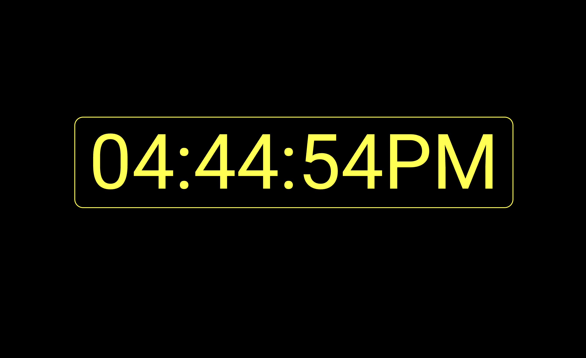

# Digital Clock
Digital Clock Supported With Full Screen

- This is a basic HTML, CSS & Javascript implementation.
- There is a folder named "dist/", which contains files compiled using webpack.
- The source code for maintenance and contributions is available in the "src/" folder.

